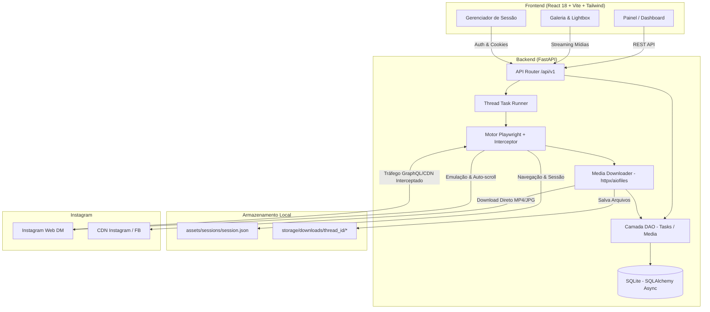

<div align="center">

# 📸🎬 DirectGrabber

**Solução Full-Stack Moderna para Extração, Backup e Download Automatizado de Mídias do Instagram Direct.**

[](https://python.org)
[](https://fastapi.tiangolo.com)
[](https://playwright.dev)
[](https://react.dev)
[](https://www.typescriptlang.org)
[](https://tailwindcss.com)
[](https://www.docker.com)

</div>

---

## 📖 Visão Geral

O **DirectGrabber** é uma plataforma desenvolvida para simplificar o backup de fotos e vídeos em alta resolução trocados em conversas privadas (**Direct Messages**) do Instagram.

Combinando um motor de automação assíncrono em **FastAPI + Playwright** com uma interface reativa e moderna em **React + Tailwind CSS** (com tema dark inspirado no Instagram), a ferramenta automatiza a navegação, intercepta pacotes GraphQL/CDN em tempo real, executa auto-scroll inteligente com rate-limiting e efetua o download e organização de todas as mídias no seu disco local.

---

## ✨ Principais Funcionalidades

- 🔐 **Autenticação Flexível**:
  - **Login Interativo**: Abre o navegador Chromium para login manual; os cookies e sessão são salvos com persistência local.
  - **Importação Manual**: Suporte a importação direta de `sessionid`, headers `Cookie` brutos ou JSON `storage_state`.
- ⚡ **Extração em Tempo Real**:
  - Interceptação de tráfego de rede (GraphQL e CDNs do Instagram/Facebook: `cdninstagram.com`, `fbcdn.net`).
  - Auto-scroll com ritmo adaptativo e delays humanizados para mitigar bloqueios de taxa (*rate limiting*).
  - Deduplicação automática de URLs e arquivos via banco de dados.
- 📥 **Download Paralelo e Assíncrono**:
  - Download streaming de fotos e vídeos MP4 em resolução máxima utilizando `httpx` e `aiofiles`.
  - Organização automática dos arquivos no disco por identificador de conversa (`storage/downloads/{thread_id}/`).
- 🖥️ **Painel de Controle Completo (Dashboard Web)**:
  - Criação e monitoramento do progresso das tarefas com barras percentuais e logs em tempo real.
  - Galeria de mídias com filtros por tipo (Foto/Vídeo) e por conversa.
  - Visualizador integrado com **Lightbox** (zoom de fotos e player de vídeo MP4).
- 🗄️ **Persistência Robusta**:
  - Banco de dados relacional assíncrono com **SQLAlchemy 2.0 (Async)** e **aiosqlite**.
  - Padrão DAO (Data Access Object) para separação limpa de responsabilidades.

---

## 🏗️ Arquitetura do Sistema



---

## 📂 Estrutura do Repositório

```text
DirectGrabber/
├── backend/
│   ├── app/
│   │   ├── api/
│   │   │   └── v1/
│   │   │       ├── endpoints/
│   │   │       │   ├── auth.py          # Endpoints de login, status e importação de cookies
│   │   │       │   ├── media.py         # Listagem, filtros e streaming de arquivos de mídia
│   │   │       │   └── tasks.py         # Inicialização e acompanhamento de tarefas de scraping
│   │   │       └── router.py            # Roteador central da API v1
│   │   ├── core/
│   │   │   └── config.py                # Configurações com Pydantic Settings e CORS
│   │   ├── dao/                         # Padrão Data Access Object
│   │   │   ├── base.py
│   │   │   ├── media_dao.py
│   │   │   └── task_dao.py
│   │   ├── db/
│   │   │   ├── database.py              # Engine async do SQLAlchemy
│   │   │   └── models.py                # Modelos Task e MediaItem
│   │   ├── schemas/                     # Schemas Pydantic para validação de entrada/saída
│   │   │   ├── auth.py
│   │   │   ├── media.py
│   │   │   └── task.py
│   │   ├── services/
│   │   │   ├── media_downloader.py      # Download assíncrono via streaming
│   │   │   ├── playwright_engine.py     # Motor headless, interceptor e scrolls
│   │   │   └── session_manager.py       # Gerenciamento de cookies e storage state
│   │   └── main.py                      # Instância FastAPI, middlewares e arquivos estáticos
│   ├── assets/
│   │   └── sessions/                    # Arquivos de sessão (.gitignore)
│   ├── storage/
│   │   └── downloads/                   # Mídias baixadas organizadas por thread (.gitignore)
│   ├── tests/                           # Testes automatizados com pytest
│   │   ├── __init__.py
│   │   └── test_dao.py
│   ├── Dockerfile                       # Build da imagem Docker do backend com Playwright
│   └── requirements.txt                 # Dependências Python
│
├── frontend/
│   ├── src/
│   │   ├── components/
│   │   │   ├── common/                  # Button, Input, Modal, Badge, Spinner
│   │   │   ├── layout/                  # Container, Navbar
│   │   │   ├── MediaGallery/            # MediaGallery, MediaCard, Lightbox
│   │   │   └── TaskMonitor/             # TaskMonitor e barra de progresso
│   │   ├── hooks/                       # useTask, useMedia
│   │   ├── pages/
│   │   │   ├── Dashboard.tsx            # Extração e monitoramento
│   │   │   ├── Gallery.tsx              # Galeria e filtros de mídias
│   │   │   └── SessionAuth.tsx          # Gerenciamento e importação de sessão
│   │   ├── services/
│   │   │   └── api.ts                   # Cliente Axios configurado
│   │   ├── types/                       # Tipagens TypeScript
│   │   ├── App.tsx                      # Componente raiz com navegação por abas
│   │   ├── index.css                    # Configurações do Tailwind CSS
│   │   └── main.tsx
│   ├── package.json
│   ├── tailwind.config.js
│   ├── tsconfig.json
│   └── vite.config.ts
│
├── docker-compose.yml                   # Orquestração completa dos serviços
├── .env.example                         # Exemplo de variáveis de ambiente
├── .gitignore                           # Proteção de sessões, mídias e caches
└── README.md
```

---

## 🚀 Instalação e Execução

### Opção 1: Execução Local

Após instalar as dependências do backend e do frontend, você pode iniciar os
dois serviços com um único comando na raiz do repositório:

```bash
./start-local.sh
```

Mantenha esse terminal aberto enquanto estiver usando a aplicação. O script
expõe a API em `http://localhost:8000` e o painel em
`http://localhost:5173`, ambos vinculados a `0.0.0.0` para acesso pelo
navegador local ou por encaminhamento de portas do ambiente de desenvolvimento.

Se o navegador informar `ERR_CONNECTION_REFUSED`, confirme que o comando acima
ainda está em execução e abra a URL exibida pelo Vite no terminal.

#### 1. Pré-requisitos
- **Python 3.11+**
- **Node.js 18+** e **npm**
- **Git**

#### 2. Configurar e Iniciar o Backend

```bash
# 1. Acesse o diretório do backend
cd backend

# 2. Crie e ative o ambiente virtual
# No Windows:
python -m venv venv
.\venv\Scripts\activate

# No Linux/macOS:
python3 -m venv venv
source venv/bin/activate

# 3. Instale as dependências
pip install -r requirements.txt

# 4. Instale o navegador Chromium do Playwright
playwright install chromium

# 5. Inicie a API com Uvicorn
uvicorn app.main:app --reload --host 0.0.0.0 --port 8000
```

- API disponível em: `http://localhost:8000`
- Documentação interativa Swagger: `http://localhost:8000/api/v1/docs`

#### 3. Configurar e Iniciar o Frontend

```bash
# 1. Em outro terminal, acesse a pasta do frontend
cd frontend

# 2. Instale as dependências do Node
npm install

# 3. Inicie o servidor Vite
npm run dev
```

- Painel Web disponível em: `http://localhost:5173`

---

### Opção 2: Execução com Docker Compose

Para subir toda a aplicação (backend + frontend) conteinerizada:

```bash
docker-compose up --build
```

- Acesse o Frontend em: `http://localhost:5173`
- Acesse a API do Backend em: `http://localhost:8000`

---

## 💡 Guia de Uso

1. **Autenticação**:
   - Abra o painel no navegador (`http://localhost:5173`).
   - Vá para a aba **Sessão / Login**.
   - Clique em **Abrir Navegador e Fazer Login**.
   - Uma janela do Chromium será aberta. Efetue seu login no Instagram. Ao concluir, a sessão será detectada e armazenada automaticamente em `session.json`.
   - *(Opcional)* Se preferir, cole seu `sessionid` ou cookies brutos no formulário de importação manual.
2. **Iniciar Extração**:
   - Acesse a aba **Extrator**.
   - Cole a URL da conversa direta do Instagram (ex: `https://www.instagram.com/direct/t/1234567890/`).
   - Ajuste o limite de rolagens (scrolls) se desejar.
   - Clique em **Extrair Mídias**.
3. **Monitoramento**:
   - Acompanhe o progresso em tempo real pelo monitor de tarefas.
4. **Visualização e Download**:
   - Clique em **Ver na Galeria** ou acerte a aba **Galeria**.
   - Filtre por fotos, vídeos ou por identificador de conversa.
   - Clique em qualquer item para expandir no **Lightbox** em alta definição.

---

## 🔌 Referência da API (Endpoints Principais)

| Método | Endpoint | Descrição |
|---|---|---|
| `GET` | `/api/v1/auth/session/status` | Verifica o status da sessão salva |
| `POST` | `/api/v1/auth/session/start` | Inicia o fluxo de login interativo via Playwright |
| `POST` | `/api/v1/auth/import-cookies` | Importa cookies ou storage state manualmente |
| `DELETE` | `/api/v1/auth/session` | Remove a sessão atual |
| `POST` | `/api/v1/tasks/start` | Cria e inicia uma tarefa de extração de mídia |
| `GET` | `/api/v1/tasks/{task_id}/status` | Obtém o progresso e status de uma tarefa |
| `GET` | `/api/v1/tasks/` | Lista o histórico de tarefas recentes |
| `GET` | `/api/v1/media/` | Lista todas as mídias salvas com filtros e paginação |
| `GET` | `/api/v1/media/thread/{thread_id}` | Lista as mídias de uma conversa específica |
| `GET` | `/api/v1/media/{media_id}/file` | Streaming e download direto do arquivo de mídia |

---

## 🧪 Testes Automatizados

Para executar a suíte de testes com o `pytest`:

```bash
cd backend
pytest tests/ -v
```

---

## 🔒 Segurança e Privacidade

- **Dados de Sessão**: Credenciais de login e arquivos de sessão (`session.json`, `browser_profile/`) contêm tokens sensíveis e estão configurados no `.gitignore` para nunca serem versionados no Git.
- **Armazenamento Local**: Todas as mídias baixadas são mantidas estritamente no disco local (`storage/downloads/`).
- **Rate Limiting e Resiliência**: O motor de scraping utiliza intervalos variáveis entre scrolls para simular a navegação humana e evitar suspensões temporárias de taxa da plataforma.

---

## 📄 Licença

Distribuído sob a licença **MIT**. Consulte o arquivo de licença para mais informações.

<div align="center">
  <sub>Desenvolvido para backup e organização pessoal de mídias.</sub>
</div>
